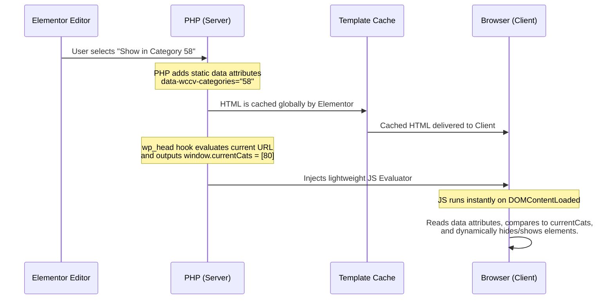

# WC Category Visibility

A lightweight, highly robust Elementor extension that adds conditional visibility logic to any Elementor element (Widget, Column, Container, or Section) based on the current WooCommerce category context.

## Features
- **Universal Support**: Integrates directly into the 'Advanced' tab of all Elementor elements.
- **Deep Hierarchy Detection**: Automatically detects parent, child, and deeply nested ancestors. If an element is set to show on "Clothing", it will automatically show on "T-Shirts" (a child of Clothing).
- **In & Not In Logic**: Choose to show elements *only when in* selected categories, or *hide them when in* selected categories.
- **100% Cache Immune**: Designed from the ground up to bypass Elementor's structural template caching and aggressive full-page caches (like WP Rocket or LiteSpeed).

## The Architecture Challenge: Elementor Template Caching

During development, a critical architectural challenge was discovered regarding how Elementor Theme Builder caches structural elements (Sections, Containers, Columns) on archive templates.

### The Problem
When using standard PHP hooks (like `before_render` or `should_render`) to conditionally hide structural elements based on the URL context, Elementor evaluates the PHP logic **only on the first page load**. It then bakes the resulting HTML (or CSS classes) directly into its database cache for that template. 

When a user navigated to a *different* category that used the *same* archive template, Elementor would serve the cached HTML from the first category. This resulted in elements being permanently stuck in a visible or hidden state across entirely different URLs.

### The Solution: Client-Side JS Evaluation Engine
To achieve dynamic URL-based visibility while maintaining compatibility with Elementor's caching engine, the plugin completely decouples evaluation from the server-side render phase.

By pushing the static requirements into `data-*` attributes and executing the dynamic comparison in the browser via JavaScript, the plugin completely bypasses both Elementor's Template Cache and server-side full-page caches.

## Usage

1. Open any page or template in the Elementor Editor.
2. Select an Element (Widget, Section, Column, or Container).
3. Navigate to the **Advanced** tab.
4. Locate the **Conditional Display (WooCommerce)** panel.
5. Select the required WooCommerce categories and choose your visibility condition.
6. Save the page. The element will now evaluate its visibility live on the frontend.
